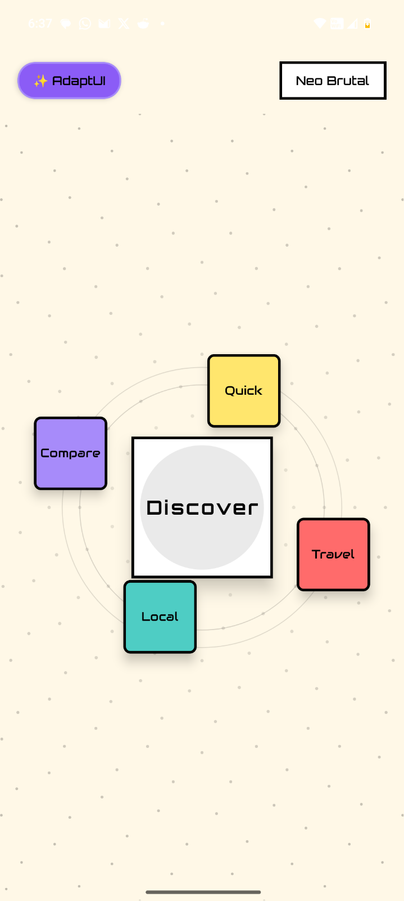
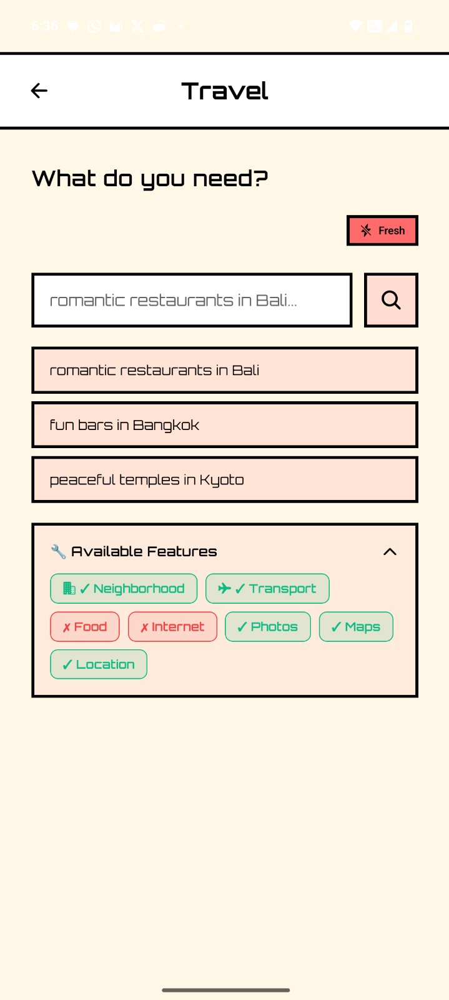
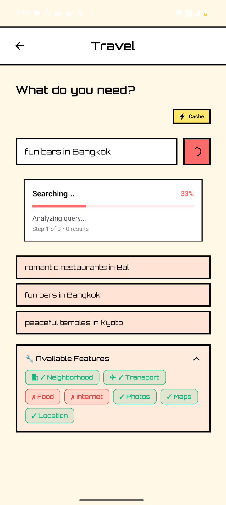
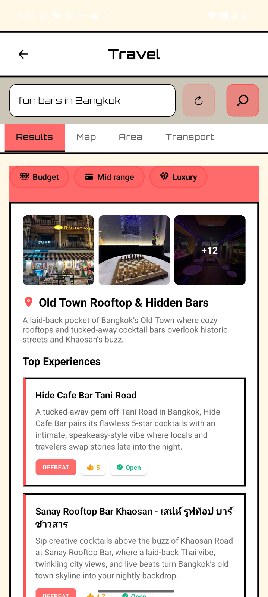

# AdaptUI

> **Interfaces that adapt to you, not the other way around.**

AdaptUI is a proof-of-concept React Native app that uses AI to generate custom user interfaces on-demand. Instead of navigating through multiple apps for different tasks, you ask AdaptUI what you need, and it creates a purpose-built interface just for that moment.

Blog: [src](https://ikouchiha47.github.io/2025/11/28/adaptui.html)

---

## 🎯 The Problem

You have 50+ apps on your phone. To plan a weekend trip, you:
1. Open Google Maps to find places
2. Switch to Weather app to check forecast
3. Open Yelp for restaurant reviews
4. Jump to Notes to write an itinerary
5. Check Calendar for availability
6. Back to Maps for directions

**This is exhausting.**

---

## 💡 The Solution

AdaptUI generates a single, unified interface for your specific need:

**You:** *"Plan a weekend trip to Portland - I like coffee, hiking, and indie bookstores"*

**AdaptUI:** Creates a custom UI with:
- Weather forecast for the weekend
- Map with pinned coffee shops, trails, and bookstores
- Itinerary timeline with travel times
- Quick notes section
- Deep links to Google Maps/Yelp

All in one screen. No app switching. No context loss.

### Screenshots

<table>
  <tr>
    <td></td>
    <td></td>
    <td></td>
    <td></td>
  </tr>
  <tr>
    <td align="center"><em>Start Screen</em></td>
    <td align="center"><em>Travel Mode</em></td>
    <td align="center"><em>Search</em></td>
    <td align="center"><em>Results</em></td>
  </tr>
</table>

---

## 🏗️ How It Works

AdaptUI uses a **two-phase architecture** that separates data gathering from UI generation:

### Phase 1: Data Gathering (3-5 seconds)
The heavy lifting happens here:

1. **Query Analysis** - LLM extracts intent, emotion, sentiment, and temporal context
2. **Query Expansion** - Generates related search terms for better coverage
3. **Parallel Fetching** - Searches multiple sources simultaneously (Google Places, web, Reddit)
4. **Data Enrichment** - Adds photos, coordinates, crowd levels, opening hours
5. **Clustering** - Groups places geographically into 3-5 areas
6. **Ranking** - Scores places using rating, popularity, relevance, and temporal signals

**Output:** Clean, enriched data with everything the UI needs.

### Phase 2: UI Generation (1-2 seconds)
Component selection and configuration:

1. **Component Selection** - LLM picks from pre-built, visually validated components
2. **Dynamic Filters** - Generates filters based on query emotion and data characteristics
3. **Variant Configuration** - Selects photo layouts, badge types, and spacing
4. **Device Adaptation** - Adjusts layout for screen size and capabilities
5. **Schema Generation** - Creates complete UISchema ready to render

**Output:** Native React Native UI with no hydration needed.

### Why Two Phases?

**Phase 1 can be slow** - It's doing real work (API calls, enrichment, clustering). Users see progress: "Searching places...", "Fetching photos...", "Analyzing crowd levels..."

**Phase 2 is fast** - No external API calls, just LLM component selection. The UI appears almost instantly after data is ready.

**Key Insight:** The LLM doesn't generate UI code. It selects from pre-built components. This is critical because **broken UI can be iterated and fixed, but bad UI can't be fixed without vision**. Pre-built components are visually validated by humans.

### Architecture Diagram

```
User Query
    ↓
┌─────────────────────────────────────────┐
│ Phase 1: Data Gathering (3-5s)         │
│                                         │
│  Query Analysis → Query Expansion      │
│       ↓                                 │
│  Parallel Fetching (Google, Web)       │
│       ↓                                 │
│  Data Enrichment (Photos, Coords)      │
│       ↓                                 │
│  Clustering & Ranking                   │
└─────────────────────────────────────────┘
    ↓
  Enriched Data
    ↓
┌─────────────────────────────────────────┐
│ Phase 2: UI Generation (1-2s)          │
│                                         │
│  Component Selection                    │
│       ↓                                 │
│  Dynamic Filter Generation              │
│       ↓                                 │
│  Variant Configuration                  │
│       ↓                                 │
│  Schema Generation                      │
└─────────────────────────────────────────┘
    ↓
  React Native UI
```

**Read more:** [BLOG_1_ADAPTUI_ARCHITECTURE.md](./blogs/BLOG_1_ADAPTUI_ARCHITECTURE.md)

---

## 🎨 Design Philosophy

### Dual Theme System
AdaptUI features two distinct visual styles:

**Glassmorphism** - Modern, elegant, professional
- Frosted glass effects with blur
- Dark gradients and subtle shadows
- Smooth, spring-based animations
- Perfect for focused, immersive experiences

**Neo-Brutal** - Bold, playful, high-energy
- Sharp edges and thick borders
- High contrast black/white with neon accents
- Hard shadows and instant feedback
- Perfect for quick, decisive interactions

Users can switch themes instantly with a single tap.

---

## 🚀 Tech Stack

### Frontend
- **React Native** - Cross-platform mobile framework
- **Expo** - Development and build tooling
- **TypeScript** - Type safety and developer experience
- **Reanimated 2** - 60fps animations on UI thread
- **Zustand** - Lightweight state management

### AI/Backend
- **Google Gemini** - LLM for reasoning and UI generation
- **LangChain** - AI orchestration and tool calling
- **SQLite** - Local persistence and caching
- **Expo Blur** - Native blur effects for glassmorphism

### Architecture
- **CategoryManager** - Intelligent query classification
- **LLMCore** - Multiple reasoning patterns (ToT, ReAct, CoT)
- **WorkflowEngine** - Background job processing with DAG execution
- **DatabaseService** - Persistent storage for queries and preferences

---

## 📱 Current Status

### ✅ Implemented
- Dual theme system (Glass/Brutal) with instant switching
- Animated landing page with smooth 60fps transitions
- Category system with keyword-based classification
- Core services (CategoryManager, DatabaseService, WorkflowEngine)
- LLM integration with Gemini
- Component renderer for dynamic UIs
- Haptic feedback on all interactions

### 🚧 In Progress
- Real API integrations (Google Places, OpenWeather)
- Map component with interactive pins
- Timeline/itinerary component
- Deep linking to external apps

### 📋 Planned
- Voice input
- Image recognition for visual queries
- Multi-step workflows
- Collaborative features
- Offline mode with caching

---

## 🎯 Use Cases

### Travel Planning
*"Plan a 3-day trip to Tokyo for a foodie"*
- Restaurant recommendations by neighborhood
- Food market tours
- Cooking class bookings
- Transit directions

### Local Discovery
*"What's happening this weekend in SF?"*
- Events calendar
- Weather-aware suggestions
- Restaurant reservations
- Activity recommendations

### Research & Comparison
*"Compare electric cars under $40k"*
- Side-by-side specs
- Pros/cons analysis
- Price trends
- User reviews summary

### Quick Tasks
*"Find a coffee shop with WiFi near me"*
- Map with nearby options
- Hours and ratings
- Walking directions
- One-tap navigation

---

## 🏃 Getting Started

### Prerequisites
- Node.js 18+
- npm or yarn
- Expo CLI
- iOS Simulator or Android Emulator

### Installation

```bash
# Clone the repository
git clone <repo-url>
cd AdaptUI

# Install dependencies
npm install

# Start the development server
npm start

# Run on specific platform
npm run ios
npm run android
npm run web
```

### Configuration

1. **Gemini API Key** - Add your key to `app/index.tsx`:
```typescript
const GEMINI_API_KEY = 'your-api-key-here';
```

2. **Theme Preference** - Toggle between Glass/Brutal using the button in top-right

---

## 📖 Documentation

- **[COMPONENT_LIBRARY.md](./docs/COMPONENT_LIBRARY.md)** - Complete component library with all 20 components, variants, and examples
- **[BLOG_1_ADAPTUI_ARCHITECTURE.md](./BLOG_1_ADAPTUI_ARCHITECTURE.md)** - Deep dive into the two-phase architecture
- **[THEME_GUIDE.md](./THEME_GUIDE.md)** - Complete theme system documentation
- **[QUICKSTART.md](./QUICKSTART.md)** - Quick start guide and demo script
- **[IMPLEMENTATION_SUMMARY.md](./IMPLEMENTATION_SUMMARY.md)** - Technical implementation details
- **[DOC.md](./DOC.md)** - Original product specification

### Interactive Showcases

- **[Component Showcase](./docs/component-showcase.html)** - Interactive component library (open in browser)

---

## 🎨 Design Inspiration

AdaptUI draws inspiration from:
- **Nothing OS** - Essential apps concept
- **Arc Browser** - Adaptive, context-aware UI
- **Stripe** - Clean, professional design
- **Linear** - Smooth animations and interactions
- **Vercel** - Dark mode aesthetics

---

## 🤔 Philosophy

### Why AdaptUI?

**Traditional Apps:**
- One app = one purpose
- Fixed UI for all users
- Context switching kills flow
- 50+ apps on your phone

**AdaptUI:**
- One app = infinite purposes
- Custom UI for each query
- No context switching
- Interfaces that adapt to you

### The Vision

We believe the future of mobile interfaces is:
- **Generative** - Created on-demand, not pre-built
- **Contextual** - Aware of your situation and needs
- **Adaptive** - Changes based on your behavior
- **Unified** - One interface for multiple data sources

AdaptUI is a step toward that future.

---

## 🚧 Limitations

This is a **proof-of-concept**. Current limitations:

- **No real API integrations** - Responses are simulated
- **Limited categories** - Only 3 categories implemented
- **No offline mode** - Requires internet connection
- **No user accounts** - All data is local
- **English only** - No i18n support yet

---

## 🤝 Contributing

This is a research project exploring the future of adaptive interfaces. Contributions, ideas, and feedback are welcome!

### Areas for Contribution
- UI/UX design improvements
- Additional reasoning patterns
- New category implementations
- API integrations
- Performance optimizations

---

## 📄 License

MIT License - See LICENSE file for details

---

## 🙏 Acknowledgments

- **Google Gemini** - AI reasoning and generation
- **Expo Team** - Amazing mobile development platform
- **React Native Community** - Incredible ecosystem
- **Nothing OS** - Inspiration for adaptive interfaces

---

## References

### Google

- [Places API](https://developers.google.com/maps/documentation/places/web-service/place-details)
- [Places Insights API](https://developers.google.com/maps/documentation/places-aggregate/make-your-first-request)
- [Place Insights](https://blog.afi.io/blog/google-places-insights-api/)
- [More Place Insights](https://mapsplatform.google.com/resources/blog/how-to-get-started-with-new-gemini-model-capabilities-for-places-api/)

---

## 📬 Contact

Questions? Ideas? Feedback?

Open an issue or start a discussion on GitHub.

---

**Built with ❤️ and AI**

*AdaptUI - Interfaces that adapt to you.*
