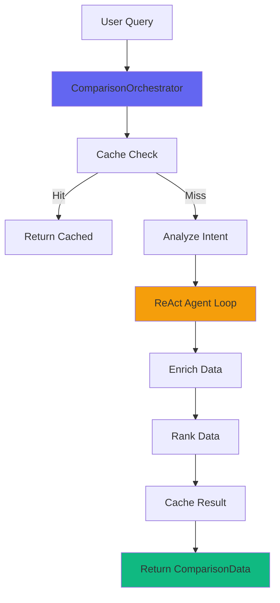

# Comparison Feature - Design

## Architecture Overview

The comparison feature follows the same orchestrator pattern as TravelService, but uses a ReAct agent for autonomous data gathering.



## Category Orchestrator Pattern

### Base Pattern (Abstract)

All category-specific services follow this pattern:

```typescript
abstract class CategoryOrchestrator<TQuery, TResult> {
  protected llm: LLMProvider;
  protected cacheService: CacheService;
  protected capabilities: CapabilityContext;
  
  // Abstract methods - each category implements these
  abstract analyzeIntent(query: TQuery): Promise<any>;
  abstract fetchData(query: TQuery, intent: any): Promise<any>;
  abstract enrichData(data: any, intent: any): Promise<any>;
  abstract rankData(data: any, query: TQuery): Promise<TResult>;
  
  // Concrete orchestration flow - same for all categories
  async process(query: TQuery): Promise<TResult> {
    console.log(`[${this.constructor.name}] Starting processing...`);
    
    // 1. Check cache
    const cacheKey = await this.generateCacheKey(query);
    const cached = await this.cacheService.get(cacheKey);
    if (cached && this.validateCache(cached)) {
      console.log(`[${this.constructor.name}] Cache hit`);
      return cached;
    }
    
    // 2. Initialize capabilities
    if (!this.capabilities) {
      this.capabilities = await CapabilityDetector.detectCapabilities();
    }
    
    // 3. Analyze intent
    console.log(`[${this.constructor.name}] Step 1: Analyzing intent...`);
    const intent = await this.analyzeIntent(query);
    
    // 4. Fetch data
    console.log(`[${this.constructor.name}] Step 2: Fetching data...`);
    const rawData = await this.fetchData(query, intent);
    
    // 5. Enrich data
    console.log(`[${this.constructor.name}] Step 3: Enriching data...`);
    const enrichedData = await this.enrichData(rawData, intent);
    
    // 6. Rank data
    console.log(`[${this.constructor.name}] Step 4: Ranking data...`);
    const result = await this.rankData(enrichedData, query);
    
    // 7. Cache result
    await this.cacheService.set(cacheKey, result);
    console.log(`[${this.constructor.name}] Complete`);
    
    return result;
  }
  
  protected abstract generateCacheKey(query: TQuery): Promise<string>;
  protected abstract validateCache(cached: TResult): boolean;
}
```

### Travel Implementation (Existing)

```typescript
class TravelOrchestrator extends CategoryOrchestrator<TravelQuery, TravelRecommendation[]> {
  private placesAPI: PlacesAPIService;
  private photosService: PlacesPhotoService;
  private transportService: TransportService;
  private rankingService: RankingService;
  
  async analyzeIntent(query: TravelQuery): Promise<TravelIntent> {
    // Extract experience type, sentiment, temporal context
    return await QueryAnalysisService.analyzeQuery(query);
  }
  
  async fetchData(query: TravelQuery, intent: TravelIntent): Promise<Place[]> {
    if (query.advancedMode) {
      // Query expansion + parallel searches
      return await QueryProcessingService.executeExpandedPlaceSearches(query);
    } else {
      // Simple LLM-only mode
      return await this.generateLLMOnlyRecommendations(query);
    }
  }
  
  async enrichData(data: Place[], intent: TravelIntent): Promise<EnrichedPlace[]> {
    // Add photos, coordinates, crowd levels, opening hours
    return await Promise.all(data.map(place => this.enrichPlace(place, intent)));
  }
  
  async rankData(data: EnrichedPlace[], query: TravelQuery): Promise<TravelRecommendation[]> {
    // Cluster by geography, rank by rating+crowd+temporal
    const clusters = this.clusterPlacesByProximity(data);
    return await this.rankingService.rankPlaces(clusters, query);
  }
}
```

### Comparison Implementation (New)

```typescript
class ComparisonOrchestrator extends CategoryOrchestrator<ComparisonQuery, ComparisonData> {
  private reactAgent: ReActAgent;
  private trustedSiteRegistry: TrustedSiteRegistry;
  private dataValidator: DataValidator;
  
  constructor() {
    super();
    
    // Initialize ReAct agent with tools
    const tools = [
      new HiddenWebViewScraper(this.trustedSiteRegistry),
      new DataExtractor(),
      new SpecsNormalizer(),
      new PricingExtractor()
    ];
    
    this.reactAgent = new ReActAgent(
      LLMProviderFactory.getProvider(),
      tools,
      15 // max iterations
    );
  }
  
  async analyzeIntent(query: ComparisonQuery): Promise<ComparisonIntent> {
    // Extract items to compare, detect structured response needs
    const analysis = await QueryAnalysisService.analyzeQuery(query.text);
    
    if (analysis.intent !== 'compare') {
      throw new Error('Not a comparison query');
    }
    
    return {
      items: this.extractItems(query.text), // ["iPhone 15 Pro", "Samsung S24 Ultra"]
      category: this.detectCategory(query.text), // "smartphones"
      needsStructuredResponse: true,
      structuredSchema: ComparisonSchema,
      comparisonDimensions: this.detectDimensions(query.text) // ["specs", "pricing", "camera"]
    };
  }
  
  async fetchData(query: ComparisonQuery, intent: ComparisonIntent): Promise<RawComparisonData> {
    // Run ReAct agent with max 15 iterations
    console.log(`[ComparisonOrchestrator] Running ReAct agent for ${intent.items.length} items...`);
    
    const agentContext = {
      query: query.text,
      items: intent.items,
      category: intent.category,
      dimensions: intent.comparisonDimensions,
      trustedSites: this.trustedSiteRegistry.getSitesForCategory(intent.category)
    };
    
    const rawData = await this.reactAgent.run(agentContext);
    
    // Validate structured response
    if (intent.structuredSchema) {
      intent.structuredSchema.parse(rawData);
    }
    
    return rawData;
  }
  
  async enrichData(data: RawComparisonData, intent: ComparisonIntent): Promise<EnrichedComparisonData> {
    // Normalize specs across items
    const normalizedSpecs = await this.normalizeSpecs(data.items, intent.category);
    
    // Extract pros/cons using LLM
    const prosConsData = await this.extractProsCons(data.items);
    
    // Validate pricing
    const validatedPricing = await this.validatePricing(data.items);
    
    // Add comparison highlights (what's different/better)
    const highlights = await this.generateHighlights(normalizedSpecs);
    
    return {
      items: data.items.map((item, idx) => ({
        ...item,
        specs: normalizedSpecs[idx],
        prosCons: prosConsData[idx],
        pricing: validatedPricing[idx]
      })),
      highlights,
      comparisonMatrix: this.buildComparisonMatrix(normalizedSpecs)
    };
  }
  
  async rankData(data: EnrichedComparisonData, query: ComparisonQuery): Promise<ComparisonData> {
    // Rank by feature match to user preferences
    const rankedItems = await this.rankByFeatureMatch(data.items, query);
    
    // Highlight winner per dimension
    const winners = this.determineWinners(data.comparisonMatrix);
    
    return {
      items: rankedItems,
      comparisonMatrix: data.comparisonMatrix,
      highlights: data.highlights,
      winners,
      summary: await this.generateSummary(rankedItems, winners)
    };
  }
  
  protected async generateCacheKey(query: ComparisonQuery): Promise<string> {
    const items = query.text.toLowerCase().replace(/\s+/g, '-');
    return await ExpoCrypto.digestStringAsync(
      ExpoCrypto.CryptoDigestAlgorithm.SHA256,
      items
    ).then(hash => hash.substring(0, 10));
  }
  
  protected validateCache(cached: ComparisonData): boolean {
    // Validate cached data has all required fields
    return cached.items.length >= 2 &&
           cached.items.every(item => item.specs && item.pricing);
  }
}
```

## ReAct Agent Loop

The ReAct agent runs autonomously to gather comparison data:

```typescript
class ReActAgent {
  constructor(
    private llm: LLMProvider,
    private tools: Tool[],
    private maxIterations: number = 15
  ) {}
  
  async run(context: AgentContext): Promise<any> {
    let iteration = 0;
    let observations: Observation[] = [];
    let collectedData: any = { items: [] };
    
    while (iteration < this.maxIterations) {
      console.log(`[ReActAgent] Iteration ${iteration + 1}/${this.maxIterations}`);
      
      // 1. Thought: LLM decides what to do next
      const thought = await this.generateThought(context, observations, collectedData);
      console.log(`[ReActAgent] Thought: ${thought.reasoning}`);
      
      // 2. Action: LLM selects tool and parameters
      const action = await this.selectAction(thought, this.tools);
      console.log(`[ReActAgent] Action: ${action.tool} with ${JSON.stringify(action.params)}`);
      
      // Check if agent is done
      if (action.type === 'finish') {
        console.log(`[ReActAgent] Agent finished after ${iteration + 1} iterations`);
        return action.result;
      }
      
      // 3. Observation: Execute tool
      try {
        const observation = await this.executeTool(action);
        console.log(`[ReActAgent] Observation: ${observation.summary}`);
        
        observations.push({ thought, action, observation });
        
        // Update collected data
        if (observation.data) {
          collectedData = this.mergeData(collectedData, observation.data);
        }
      } catch (error) {
        console.error(`[ReActAgent] Tool execution failed:`, error);
        observations.push({ 
          thought, 
          action, 
          observation: { error: error.message, summary: 'Tool failed' }
        });
      }
      
      iteration++;
    }
    
    console.warn(`[ReActAgent] Max iterations reached, returning partial data`);
    return collectedData;
  }
  
  private async generateThought(
    context: AgentContext,
    observations: Observation[],
    collectedData: any
  ): Promise<Thought> {
    const prompt = `You are a comparison research agent. Your goal is to gather complete data for comparing these items:
${context.items.map((item, i) => `${i + 1}. ${item}`).join('\n')}

Category: ${context.category}
Comparison dimensions: ${context.dimensions.join(', ')}

Trusted sites you can scrape:
${context.trustedSites.map(site => `- ${site}`).join('\n')}

Previous observations:
${observations.map((o, i) => `${i + 1}. ${o.thought.reasoning} → ${o.action.tool} → ${o.observation.summary}`).join('\n')}

Data collected so far:
${JSON.stringify(collectedData, null, 2)}

What should you do next? Think step by step:
1. What data is still missing?
2. Which site should you visit?
3. What tool should you use?

Return JSON:
{
  "reasoning": "I need to get specs for iPhone 15 Pro. I'll visit apple.com/iphone-15-pro/specs",
  "nextAction": "scrape_website",
  "confidence": 0.9
}`;

    const response = await this.llm.generateJSON(prompt);
    return JSON.parse(response);
  }
  
  private async selectAction(thought: Thought, tools: Tool[]): Promise<Action> {
    // Check if agent wants to finish
    if (thought.nextAction === 'finish') {
      return { type: 'finish', result: thought.result };
    }
    
    // Find tool
    const tool = tools.find(t => t.name === thought.nextAction);
    if (!tool) {
      throw new Error(`Tool not found: ${thought.nextAction}`);
    }
    
    // Generate tool parameters
    const paramsPrompt = `Generate parameters for tool: ${tool.name}
Tool description: ${tool.description}
Tool schema: ${JSON.stringify(tool.schema)}
Reasoning: ${thought.reasoning}

Return JSON matching the tool schema.`;
    
    const params = await this.llm.generateJSON(paramsPrompt);
    
    return {
      type: 'tool',
      tool: tool.name,
      params: JSON.parse(params)
    };
  }
  
  private async executeTool(action: Action): Promise<Observation> {
    const tool = this.tools.find(t => t.name === action.tool);
    if (!tool) {
      throw new Error(`Tool not found: ${action.tool}`);
    }
    
    const result = await tool.execute(action.params);
    
    return {
      data: result.data,
      summary: result.summary || 'Tool executed successfully',
      success: true
    };
  }
  
  private mergeData(existing: any, newData: any): any {
    // Merge new data into existing data structure
    if (newData.item) {
      const itemIndex = existing.items.findIndex((i: any) => i.name === newData.item.name);
      if (itemIndex >= 0) {
        existing.items[itemIndex] = { ...existing.items[itemIndex], ...newData.item };
      } else {
        existing.items.push(newData.item);
      }
    }
    return existing;
  }
}
```

## Tools

### HiddenWebViewScraper Tool

```typescript
class HiddenWebViewScraper implements Tool {
  name = 'scrape_website';
  description = 'Scrape a website using hidden WebView. Returns HTML content.';
  schema = z.object({
    url: z.string().url(),
    waitForSelector: z.string().optional(),
    timeout: z.number().default(10000)
  });
  
  constructor(private trustedSiteRegistry: TrustedSiteRegistry) {}
  
  async execute(params: { url: string; waitForSelector?: string; timeout?: number }): Promise<ToolResult> {
    // Validate URL
    if (!this.trustedSiteRegistry.isAllowed(params.url)) {
      throw new Error(`Domain not in trusted list: ${params.url}`);
    }
    
    console.log(`[HiddenWebViewScraper] Scraping: ${params.url}`);
    
    // Use existing HiddenWebViewScraper component
    const html = await HiddenWebViewScraperComponent.scrape({
      url: params.url,
      waitForSelector: params.waitForSelector,
      timeout: params.timeout
    });
    
    return {
      data: { html, url: params.url },
      summary: `Scraped ${html.length} characters from ${params.url}`
    };
  }
}
```

### DataExtractor Tool

```typescript
class DataExtractor implements Tool {
  name = 'extract_data';
  description = 'Extract structured data from HTML using LLM.';
  schema = z.object({
    html: z.string(),
    schema: z.object({}).passthrough(),
    instructions: z.string()
  });
  
  constructor(private llm: LLMProvider) {}
  
  async execute(params: { html: string; schema: any; instructions: string }): Promise<ToolResult> {
    console.log(`[DataExtractor] Extracting data from ${params.html.length} chars of HTML`);
    
    const prompt = `Extract structured data from this HTML:

HTML (truncated):
${params.html.substring(0, 5000)}...

Instructions: ${params.instructions}

Expected schema:
${JSON.stringify(params.schema, null, 2)}

Return JSON matching the schema.`;
    
    const extracted = await this.llm.generateJSON(prompt);
    const data = JSON.parse(extracted);
    
    return {
      data,
      summary: `Extracted ${Object.keys(data).length} fields`
    };
  }
}
```

### TrustedSiteRegistry

```typescript
class TrustedSiteRegistry {
  private trustedDomains: Map<string, string[]> = new Map([
    ['smartphones', [
      'apple.com',
      'samsung.com',
      'gsmarena.com',
      'techradar.com',
      'cnet.com',
      'theverge.com'
    ]],
    ['cars', [
      'tesla.com',
      'bmw.com',
      'caranddriver.com',
      'motortrend.com',
      'edmunds.com'
    ]],
    ['software', [
      'notion.so',
      'obsidian.md',
      'g2.com',
      'capterra.com',
      'producthunt.com'
    ]]
  ]);
  
  isAllowed(url: string): boolean {
    const domain = new URL(url).hostname.replace('www.', '');
    
    for (const [category, domains] of this.trustedDomains) {
      if (domains.some(trusted => domain === trusted || domain.endsWith(`.${trusted}`))) {
        return true;
      }
    }
    
    return false;
  }
  
  getSitesForCategory(category: string): string[] {
    return this.trustedDomains.get(category) || [];
  }
  
  addDomain(category: string, domain: string): void {
    const domains = this.trustedDomains.get(category) || [];
    domains.push(domain);
    this.trustedDomains.set(category, domains);
  }
}
```

## Data Structures

```typescript
// Query
interface ComparisonQuery {
  text: string; // "Compare iPhone 15 Pro vs Samsung S24 Ultra"
}

// Intent
interface ComparisonIntent {
  items: string[]; // ["iPhone 15 Pro", "Samsung S24 Ultra"]
  category: string; // "smartphones"
  needsStructuredResponse: boolean;
  structuredSchema: z.ZodSchema;
  comparisonDimensions: string[]; // ["specs", "pricing", "camera", "battery"]
}

// Raw data from agent
interface RawComparisonData {
  items: Array<{
    name: string;
    specs: Record<string, any>;
    pricing: Record<string, any>;
    reviews: any[];
    sourceUrls: string[];
  }>;
}

// Enriched data
interface EnrichedComparisonData {
  items: Array<{
    name: string;
    specs: NormalizedSpecs;
    prosCons: { pros: string[]; cons: string[] };
    pricing: ValidatedPricing;
  }>;
  highlights: ComparisonHighlight[];
  comparisonMatrix: ComparisonMatrix;
}

// Final result
interface ComparisonData {
  items: Array<{
    name: string;
    specs: NormalizedSpecs;
    prosCons: { pros: string[]; cons: string[] };
    pricing: ValidatedPricing;
    rank: number;
  }>;
  comparisonMatrix: ComparisonMatrix;
  highlights: ComparisonHighlight[];
  winners: Record<string, string>; // { "camera": "iPhone 15 Pro", "battery": "Samsung S24 Ultra" }
  summary: string;
}
```

## Integration with Existing System

### 1. Extend QueryAnalysisService

```typescript
// In QueryAnalysisService.analyzeQuery()
if (intent === 'compare') {
  const items = this.extractComparisonItems(query);
  
  return {
    ...analysis,
    intent: 'compare',
    needsStructuredResponse: true,
    structuredSchema: ComparisonSchema,
    items,
    category: this.detectCategory(items)
  };
}
```

### 2. Route to ComparisonOrchestrator

```typescript
// In main query handler
const analysis = await QueryAnalysisService.analyzeQuery(query);

if (analysis.intent === 'compare') {
  const comparisonOrchestrator = new ComparisonOrchestrator();
  const data = await comparisonOrchestrator.process({ text: query });
  
  // Generate UI
  const uiSchema = await UIGenerator.generateUI(query, data, analysis);
  return { data, uiSchema };
}
```

### 3. UI Generation

Uses existing UIGenerator with comparison-specific prompt:

```typescript
// In prompts.ts
export function buildComparisonUIPrompt(
  data: ComparisonData,
  analysis: QueryAnalysis,
  context: DeviceContext
): string {
  return `Generate a comparison UI for these items:

Items:
${data.items.map(item => `- ${item.name}`).join('\n')}

Comparison Matrix:
${JSON.stringify(data.comparisonMatrix, null, 2)}

Winners:
${Object.entries(data.winners).map(([dim, winner]) => `- ${dim}: ${winner}`).join('\n')}

Generate a side-by-side comparison layout with:
1. Header with item names
2. Specs table with highlighting (winner gets green badge)
3. Pros/cons lists
4. Pricing comparison
5. Summary section

Use existing components: comparison-table, pros-cons-list, pricing-card`;
}
```

## File Structure

```
src/
├── services/
│   ├── comparison/
│   │   ├── ComparisonOrchestrator.ts       # Main orchestrator
│   │   ├── ReActAgent.ts                   # General ReAct agent
│   │   ├── TrustedSiteRegistry.ts          # Domain whitelist
│   │   ├── tools/
│   │   │   ├── HiddenWebViewScraper.ts     # Scraping tool
│   │   │   ├── DataExtractor.ts            # LLM extraction tool
│   │   │   ├── SpecsNormalizer.ts          # Normalize specs
│   │   │   └── PricingExtractor.ts         # Extract pricing
│   │   └── types.ts                        # Type definitions
│   └── base/
│       └── CategoryOrchestrator.ts         # Abstract base class
├── ui-engine/
│   ├── components/
│   │   ├── ComparisonTableRenderer.tsx     # New component
│   │   ├── ProsConsListRenderer.tsx        # New component
│   │   └── PricingCardRenderer.tsx         # New component
│   └── prompts.ts                          # Add comparison prompts
```

## Summary

The comparison feature uses the **same orchestrator pattern as TravelService** but with:

1. **ReAct agent for data gathering** - Autonomous web scraping with tools
2. **Category-specific enrichment** - Normalize specs, extract pros/cons, validate pricing
3. **Comparison-specific ranking** - Rank by feature match, determine winners
4. **Existing UI generation** - Uses UIGenerator with comparison-specific prompts

**No changes to:**
- LLM providers
- Existing TravelService
- Existing UIGenerationService
- Existing ComponentRenderer

**New code:**
- ComparisonOrchestrator (follows CategoryOrchestrator pattern)
- ReActAgent (general-purpose, reusable)
- Tools (HiddenWebViewScraper, DataExtractor, etc.)
- TrustedSiteRegistry
- Comparison-specific components
